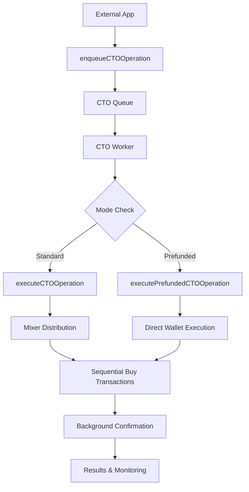

# CTO (Call To Others) Queue System

The CTO Queue System enables external applications to perform coordinated token buying operations through a robust queue and worker architecture. This system supports both standard (mixer-based) and prefunded (direct wallet) execution modes.

## 🎯 Overview

The CTO feature creates coordinated buying pressure on tokens through multiple wallets and platforms, supporting:

- **Standard Mode**: Uses secure mixer for anonymous fund distribution
- **Prefunded Mode**: Direct execution from pre-funded buyer wallets
- **Multi-Platform Support**: PumpFun, Bonk, PumpSwap, CPMM, and fallback routing
- **Real-time Progress Tracking**: Socket.IO integration for live updates
- **Robust Error Handling**: Automatic retries and graceful failure recovery

## 📋 Architecture

### Core Components

1. **CTOJob Type** (`src/jobs/types.ts`)
   - Defines the job structure and parameters
2. **CTO Queue** (`src/jobs/queues.ts`)
   - BullMQ queue for job management with Redis backing
3. **CTO Worker** (`src/jobs/workers.ts`)
   - Processes CTO operations with progress tracking
4. **External Interface** (`src/jobs/cto-external.ts`)
   - Helper functions for external application integration

### Execution Flow



## 🚀 Quick Start

### Basic Usage

```typescript
import { enqueueCTOOperation } from "./src/jobs/cto-external";

// Standard CTO operation
const job = await enqueueCTOOperation({
  userId: "user123",
  userChatId: 12345,
  tokenAddress: "So11111111111111111111111111111111111111112",
  buyAmount: 1.5, // SOL amount
  mode: "standard", // or "prefunded"
  platform: "pumpfun", // detected platform
  socketUserId: "socket123", // optional for progress tracking
});

console.log("Job ID:", job.jobId);
```

### Monitoring Job Progress

```typescript
import { getCTOJobStatus } from "./src/jobs/cto-external";

const status = await getCTOJobStatus(job.jobId);
console.log("Status:", status.status);
console.log("Progress:", status.progress);
```

## 📊 Job Types and Modes

### CTOJob Interface

```typescript
export type CTOJob = {
  userId: string; // User identifier
  userChatId: number; // Telegram chat ID
  tokenAddress: string; // Target token address
  buyAmount: number; // SOL amount to spend
  mode: "standard" | "prefunded"; // Execution mode
  platform: string; // Target platform (pumpfun, bonk, etc.)
  socketUserId?: string; // Optional socket ID for progress tracking
};
```

### Execution Modes

#### Standard Mode

- **Source**: Funding wallet
- **Process**: Secure mixer → Anonymous distribution → Coordinated buys
- **Security**: High privacy through fund mixing
- **Speed**: ~30-60 seconds (includes mixer operations)
- **Use Case**: Privacy-focused operations

#### Prefunded Mode

- **Source**: Pre-funded buyer wallets
- **Process**: Direct wallet execution → Immediate transactions
- **Security**: Standard security without mixing
- **Speed**: ~15-30 seconds (no mixer delay)
- **Use Case**: Fast execution with existing wallet funds

## 🏗️ Platform Support

### Supported Platforms

| Platform | Code       | Description             | Trading Method               |
| -------- | ---------- | ----------------------- | ---------------------------- |
| PumpFun  | `pumpfun`  | Bonding curve trading   | Direct bonding curve         |
| Bonk     | `bonk`     | Raydium Launch Lab      | Bonk pool trading            |
| PumpSwap | `pumpswap` | DEX trading             | Jupiter → PumpSwap routing   |
| CPMM     | `cpmm`     | Raydium CPMM            | Graduated token trading      |
| Meteora  | `meteora`  | Direct Bonding Curve    | DBC trading                  |
| Heaven   | `heaven`   | Advanced DEX            | Advanced trading             |
| Unknown  | `unknown`  | Multi-platform fallback | Jupiter → PumpSwap → PumpFun |

### Platform Detection

The system automatically detects the optimal platform for each token:

```typescript
// Automatic platform detection in worker
const platform = await detectTokenPlatformWithCache(tokenAddress);
```

## 🔧 API Reference

### enqueueCTOOperation

Enqueues a new CTO operation for processing.

```typescript
enqueueCTOOperation(
  jobData: CTOJob,
  priority?: number
): Promise<{ jobId: string; status: string; data: CTOJob }>
```

**Parameters:**

- `jobData`: CTOJob - The CTO operation parameters
- `priority`: number - Job priority (optional, default: 0)

**Returns:** Promise with job information

### getCTOJobStatus

Retrieves the current status of a CTO job.

```typescript
getCTOJobStatus(jobId: string): Promise<{
  jobId: string;
  status: string;
  progress: number;
  data: CTOJob;
  finishedOn?: number;
  processedOn?: number;
  failedReason?: string;
}>
```

### cancelCTOJob

Cancels a pending CTO job.

```typescript
cancelCTOJob(jobId: string): Promise<{
  success: boolean;
  error?: string;
  message?: string;
}>
```

## 🎮 Usage Examples

### Example 1: Standard CTO Operation

```typescript
const standardCTO = await enqueueCTOOperation({
  userId: "user123",
  userChatId: 12345,
  tokenAddress: "So11111111111111111111111111111111111111112",
  buyAmount: 2.0,
  mode: "standard",
  platform: "pumpfun",
});
```

### Example 2: Prefunded CTO Operation

```typescript
const prefundedCTO = await enqueueCTOOperation({
  userId: "user456",
  userChatId: 67890,
  tokenAddress: "EPjFWdd5AufqSSqeM2qN1xzybapC8G4wEGGkZwyTDt1v",
  buyAmount: 1.5,
  mode: "prefunded",
  platform: "bonk",
});
```

### Example 3: Batch Operations

```typescript
const tokens = ["token1", "token2", "token3"];
const jobs = await Promise.all(
  tokens.map((tokenAddress) =>
    enqueueCTOOperation({
      userId: "batch_user",
      userChatId: 11111,
      tokenAddress,
      buyAmount: 1.0,
      mode: "standard",
      platform: "pumpfun",
    })
  )
);
```

### Example 4: Real-time Progress Monitoring

```typescript
const job = await enqueueCTOOperation({...});
const jobId = job.jobId;

// Poll for status updates
const pollStatus = async () => {
  const status = await getCTOJobStatus(jobId);

  if (status.status === "active") {
    console.log(`Progress: ${status.progress}%`);
    setTimeout(pollStatus, 2000); // Check again in 2 seconds
  } else {
    console.log("Final status:", status.status);
  }
};

pollStatus();
```

## 🔒 Security Features

### Wallet Security

- Automatic encryption detection for wallet keys
- Secure decryption with environment-based secrets
- Safe balance validation before operations

### Transaction Safety

- Comprehensive error handling at each phase
- Automatic retry mechanisms with exponential backoff
- Background transaction confirmation
- Safe fund recovery options

### Progress Tracking

- Real-time Socket.IO updates
- Debug-controlled progress emission
- User interface synchronization

## ⚡ Performance Optimizations

### Worker Configuration

- Single concurrency to avoid conflicts
- Exponential backoff for retries
- Queue management with job retention limits

### Execution Optimizations

- Parallel wallet processing with rate limiting
- Platform-specific routing for optimal execution
- Cached platform detection results
- Background transaction confirmation

## 🛠️ Setup and Configuration

### Prerequisites

- Redis server for BullMQ queue management
- MongoDB for user and wallet data
- Configured funding and buyer wallets
- Valid Solana RPC endpoints

### Environment Variables

```bash
# Required for wallet encryption/decryption
ENCRYPTION_SECRET=your_encryption_secret

# Redis configuration for BullMQ
REDIS_URL=redis://localhost:6379

# MongoDB for user data
MONGODB_URI=mongodb://localhost:27017/nitro-launch-bot

# Solana RPC endpoints
SOLANA_RPC_URL=https://api.mainnet-beta.solana.com
```

### Starting the Worker

```typescript
// Include in your job service startup
import "./src/jobs/index"; // This registers all workers including CTO

// Or register specifically
import { ctoWorker } from "./src/jobs/workers";
// Worker will automatically start processing jobs
```

## 📈 Monitoring and Debugging

### Job Status Tracking

```typescript
// Check job status
const status = await getCTOJobStatus(jobId);

// Possible statuses:
// - "waiting": Job is queued
// - "active": Job is being processed
// - "completed": Job completed successfully
// - "failed": Job failed with error
// - "not_found": Job doesn't exist
```

### Progress Events

The system emits detailed progress events through Socket.IO:

```typescript
// Progress phases:
// 1. "CTO Operation Started" (10%)
// 2. "Validating Parameters" (25%)
// 3. "Platform Detection" (45%)
// 4. "Executing Operation" (70%)
// 5. "CTO Operation Completed" (100%)
```

### Error Handling

```typescript
try {
  const job = await enqueueCTOOperation({...});
  const status = await getCTOJobStatus(job.jobId);

  if (status.status === "failed") {
    console.error("Job failed:", status.failedReason);
  }
} catch (error) {
  console.error("CTO operation error:", error);
}
```

## 🔄 Integration with Existing Systems

### Bot Integration

The queue system integrates seamlessly with the existing Telegram bot:

```typescript
// Bot conversation can enqueue jobs
const job = await enqueueCTOOperation({
  userId: user.id,
  userChatId: ctx.chat.id,
  // ... other parameters
});
```

### External Application Integration

External apps can use the queue without the bot interface:

```typescript
import { enqueueCTOOperation } from "./src/jobs/cto-external";

// Direct API usage
const result = await enqueueCTOOperation({
  // External application parameters
});
```

## 📋 Best Practices

### Job Management

1. **Always check job status** after enqueueing
2. **Handle job failures gracefully** with appropriate error messages
3. **Use batch operations** for multiple tokens efficiently
4. **Set appropriate priorities** for time-sensitive operations

### Error Recovery

1. **Monitor failed jobs** and implement retry logic
2. **Validate user wallets** before enqueueing operations
3. **Handle partial successes** appropriately
4. **Provide user feedback** for all operation states

### Performance

1. **Avoid enqueueing duplicate jobs** for the same parameters
2. **Use appropriate timeouts** for job monitoring
3. **Clean up completed jobs** to prevent memory issues
4. **Monitor queue health** and worker performance

## 🤝 Contributing

When contributing to the CTO queue system:

1. **Follow the existing pattern** for new job types
2. **Add comprehensive error handling** for all operations
3. **Include progress tracking** for user experience
4. **Update documentation** for any new features
5. **Test with both modes** (standard and prefunded)

## 📝 Changelog

### v1.0.0 - Initial Release

- ✅ Standard and prefunded CTO modes
- ✅ Multi-platform support (PumpFun, Bonk, etc.)
- ✅ Real-time progress tracking
- ✅ Comprehensive error handling
- ✅ External application interface
- ✅ Job management utilities
- ✅ Example usage patterns

---

For more detailed examples, see `examples/cto-external-usage.ts`.
